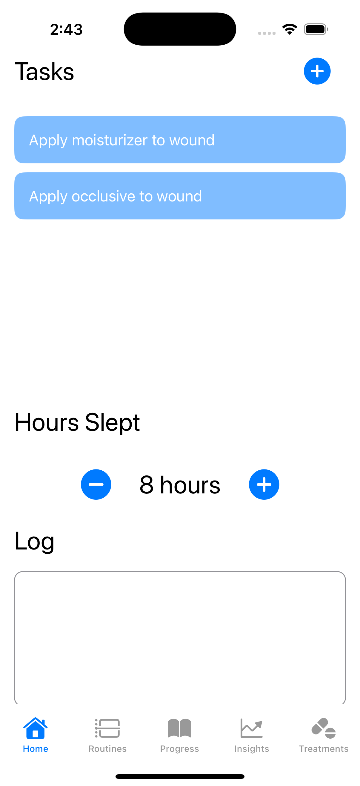
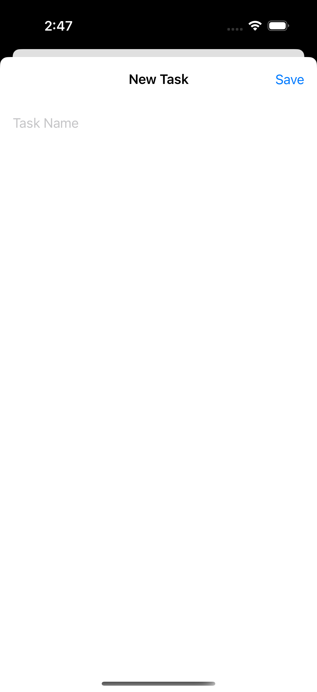
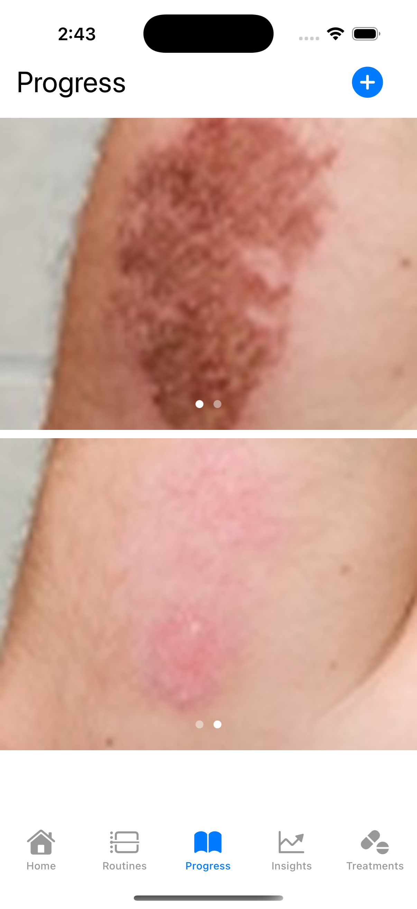
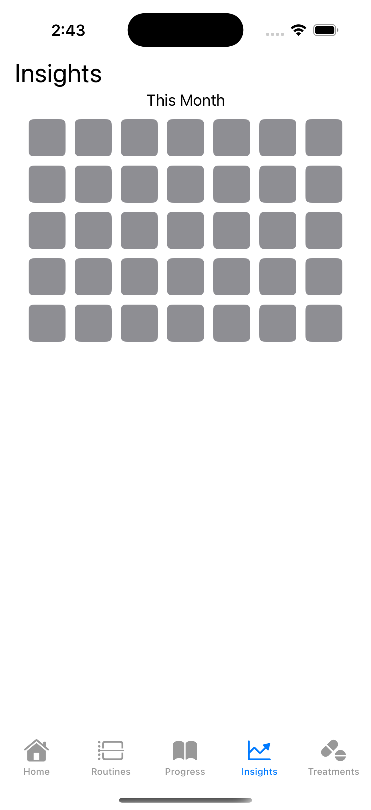

## Health App
Purpose: This app is intended to help people keep track of their health habits, treatments, and progress. It allows users to check off tasks they need to do consistently and log confounding variables that may have an impact on their health.

## Video

[Demo Video Link](https://drive.google.com/file/d/1BHNcbVcsTNd8mheCZFWzfdb6bxr1VZC1/view?usp=sharing)

## Photos

### Home Page

### Tasks Page

### Progress Page

### Insights Page

### Key Features
- Tasks: Users can track everything they need to do and stay consistent, such as remembering to take their medications or apply treatments. 
- Journal: Each day, users can log their condition, reflecting on how they felt and whether there was any improvement. 
- Logging Potential Confounding Variables: Sleep amount and weather are factors that could potentially affect health, so the app allows users to log how much they sleep every night and it keeps track of weather conditions. 
- Monitor Progress: There’s a page for users to see photos of their condition over time, if needed.

### Obstacles
- One of the APIs I used needed the information to be used differently than how we were taught in the bootcamp. I had to figure out how to adjust and use the new method instead. 
- Understanding how everything was supposed to fit together was a bit of a struggle. Figuring out how different parts of it connected and worked was a learning curve for me.
- I also struggled with getting the syntax right throughout the project. Small errors would pop up that confused me, and I had to spend time figuring out what was wrong and how to fix them.
- For a bigger obstacle, I hoped to implement a lot more features than I was able to. After getting started, I realized there were many things I didn’t know how to do yet. One major challenge was figuring out how to properly save and keep track of user inputs. For example, allowing users to log their health habits and symptoms daily, having the app keep track of the weather data, and having the screen reset every day, and then also being able to use that stored information to display progress and insights for the user in calendar displays. I found that handling user data storage and retrieval was a bit out of my ability, and I still don’t know how to do that but I hope to figure it out. So for now, some of the app’s content is undercooked/hard coded just to demonstrate the general idea and layout
- I wanted to be able to have more advanced displays, like custom calendar views and scrollable progress photos arranged in order of date, but that’s also outside of my ability right now.

### Future Additions
- I want to add the ability to store user inputs so that they can be used to display insights, statistics, and trends. A key feature I would like to introduce is progress tracking. Users would be able to see progress bars that show how much of their tasks they completed over different periods of time, like daily, weekly, or monthly. They would also be able to filter by individual tasks. For example, they can see that they completed 70% of a specific task  or view their overall completion rates, such as completing 80% of all assigned tasks during a week, month, or year.
- I also want to give users the ability to create custom symptoms and rate the severity of each symptom every day. This information would be logged and stored to help them identify patterns over time and better understand how their condition changes.
- Another feature is the creation of customizable routines. Users would be able to set up routines that involve completing tasks in a specific order on specific days, rather than simply repeating all tasks daily. For example, some treatments might only need to be done every other day, or certain tasks might need to happen in a particular sequence. The app would automatically update and display only the tasks required for the current day, helping users stay organized without overwhelming them with irrelevant tasks.
- On the progress page, users would have the option to choose which data they want to view and compare. They would also be able to upload photos tied to specific dates and scroll through them, with before and after views to compare. Clicking on a photo would bring up all relevant information from that day, such as the weather, hours of sleep, products used, symptom ratings, and journal entries,  making it easier to connect changes in their health to external factors.
- It would also be valuable for the app to display statistics across different time periods, like weekly, monthly, and yearly, with flexible filtering options. For example, users could filter by a specific symptom to track its severity over time or compare symptom flare-ups with the usage of certain products. The app could generate insights like, “This product was used on 50% of the days when this symptom occurred,” or, “This product was used on 100% of the days when the symptom occurred,” helping users spot potential correlations between triggers and their health conditions.
- Another addition would be a detailed log for products users have tried. They could upload a photo, add product names and descriptions, categorize them into groups (like liquids, pills, or creams), and add tags for easier filtering. Users would also be able to mark products as “safe” or “unsafe” based on their experiences, helping them keep track of what to avoid or continue using in the future.
- Logging confounding variables, such as weather, sleep, and environmental exposures, would continue to be a major part of the app. Users could compare these variables with symptom trends to uncover hidden triggers, like noticing that certain symptoms worsened on high pollen days, or after coming into contact with allergens like certain metals, mold, or animals, which would connect back to the daily journal, where users could reflect on what they experienced each day. Having this journal would help users recognize patterns they might not have noticed before, giving them a clearer picture of their health and helping them know how to move forward.
